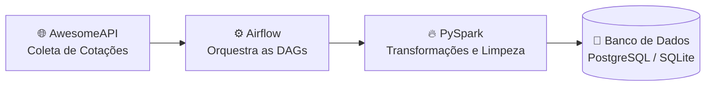

# 💱 Currency Quotes Automation

🚀 **Automatiza a extração de cotações de moedas e salva em um banco de dados com pipelines orquestrados no Apache Airflow.**

---

## 💡 Sobre o Projeto

Este projeto foi desenvolvido como estudo prático de **orquestração de pipelines de dados** com **Apache Airflow**, integrando APIs externas (AwesomeAPI) para **coleta automatizada de cotações de moedas** e salvando os dados tratados em bancos **PostgreSQL** ou **SQLite**.  

Ele demonstra conceitos de **ETL/ELT**, **boas práticas com Pydantic**, e **execução distribuída com PySpark**, totalmente containerizado com **Docker**.

---

## 🧭 Fluxo de Dados



📊 O Airflow agenda e executa DAGs diárias para coletar as cotações, processá-las com PySpark e persistir no banco relacional escolhido.

---

## 🛠️ Tecnologias Utilizadas

- 🐍 Python  
- ⚡ PySpark  
- 🧮 Pandas  
- 🪶 Apache Airflow  
- 🐳 Docker  
- 🧩 Pydantic  
- 🐘 PostgreSQL / 🪶 SQLite  

---

## 🐳 Executando via Docker

### ⚙️ Requisitos
- Docker Desktop instalado  
- `docker-compose` disponível  

---

### 1️⃣ Clone o repositório
```bash
git clone https://github.com/joaobarreto27/study_currency_quotes_1_1
cd study_currency_quotes_1_1
```

---

### 2️⃣ Crie o arquivo `.env` na raiz do projeto
```env
API_TOKEN=seu_token_api
AIRFLOW_IMAGE_NAME=apache/airflow:2.5.1
AIRFLOW_UID=50000
```

🔑 **Gerando o API Token:**
- Acesse [AwesomeAPI - Instruções de API Key](https://docs.awesomeapi.com.br/instrucoes-api-key)
- Gere seu token e preencha a variável `API_TOKEN` no `.env`

---

### 3️⃣ Suba os serviços

```bash
# 1️⃣ Buildar tudo (sem cache):
docker-compose build --no-cache

# 2️⃣ Subit somente o cotainer init:
docker-compose up airflow-init

# 3️⃣ Subir todo o restante do ambiente ambiente:
docker-compose up -d
```

✅ O Airflow estará disponível em:  
👉 [http://localhost:8080](http://localhost:8080)

Caso seja alterado algo no ambiente docker, basta realizar o comando abaixo:
```bash
docker-compose up -d
```

---

## 💻 Executando Localmente (sem Docker) com Poetry

> ⚠️ **Atenção:** Rodar este projeto fora do Docker exige que você tenha configurado corretamente o **PySpark** e o **Java (JDK 17+)** no ambiente local.

### 🧰 Requisitos
- Python 3.10+  
- Java JDK 17 ou superior  
- Apache Spark (3.3+ recomendado)  
- Variáveis de ambiente configuradas:  
  - `JAVA_HOME` apontando para o diretório do JDK  
  - `SPARK_HOME` apontando para o diretório do Spark  
  - Adicionar `SPARK_HOME/bin` ao `PATH`

### ⚙️ Passos para configuração manual
```bash
# 1️⃣ Instale o Java (Linux / Mac)
sudo apt install openjdk-17-jdk -y

# 2️⃣ Baixe e configure o Apache Spark
wget https://downloads.apache.org/spark/spark-3.3.4/spark-3.3.4-bin-hadoop3.tgz
tar -xzf spark-3.3.4-bin-hadoop3.tgz
mv spark-3.3.4-bin-hadoop3 /opt/spark

# Configure variáveis de ambiente
export SPARK_HOME=/opt/spark
export PATH=$PATH:$SPARK_HOME/bin
export JAVA_HOME=/usr/lib/jvm/java-17-openjdk-amd64

# 3️⃣ Instale o Poetry se ainda não tiver
curl -sSL https://install.python-poetry.org | python3 -

# 4️⃣ Instale dependências do projeto via Poetry
poetry install

# 5️⃣ Ative o ambiente do Poetry
poetry shell

# 6️⃣ Execute o pipeline localmente
python dags/etl/src/main.py
```

> 💡 **Dica:** Mesmo com tudo configurado, é **altamente recomendado usar Docker** para garantir reprodutibilidade e compatibilidade com o Airflow e PySpark.

---

## 🗂️ Estrutura do Projeto

```bash
├── dags/  
│   └── etl/
│       ├── dags/                     # DAGs do Airflow
│       └── src/
│           ├── infrastructure/
│           │   ├── data/currency_quotes/   # Extração de cotações (ARS, USD, BTC, etc.)
│           │   ├── databases_connection/   # Conexões SQL
│           │   ├── market_data/            # Comandos de manipulação de dados
│           │   ├── utils/                  # Funções auxiliares
│           │   └── worker/                 # Workers por moeda
│           └── ...
├── logs/                          # Logs do Airflow
├── plugins/                       # Plugins personalizados
└── docker-compose.yml
```

---

## 💾 Banco de Dados

O projeto utiliza **PostgreSQL** em produção, mas também suporta **SQLite** para testes locais.

Exemplo de configuração no código:

```python
USE_SQLITE = True

connection = ConnectionDatabaseSpark(
    sgbd_name="sqlite" if USE_SQLITE else "postgresql",
    environment="prd" if USE_SQLITE else "prd",
    db_name="1.1_study_currency_quotes",
)
```

---

## 👨‍💻 Autor

Desenvolvido por [**João Barreto**](https://github.com/joaobarreto27) 💻  
Projeto de estudo em Engenharia de Dados com foco em automação e orquestração de pipelines.

---

## 📜 Licença

Este projeto está licenciado sob a [MIT License](LICENSE).

---
